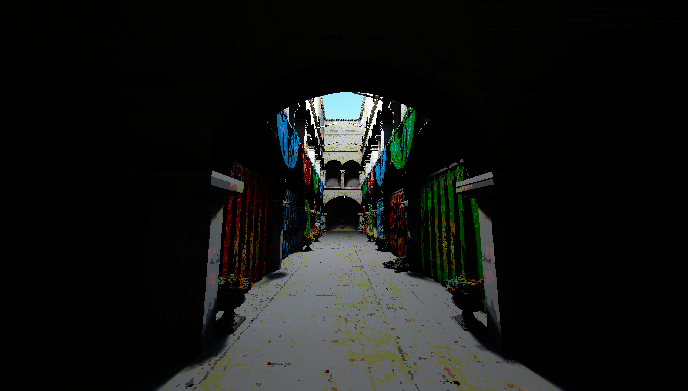
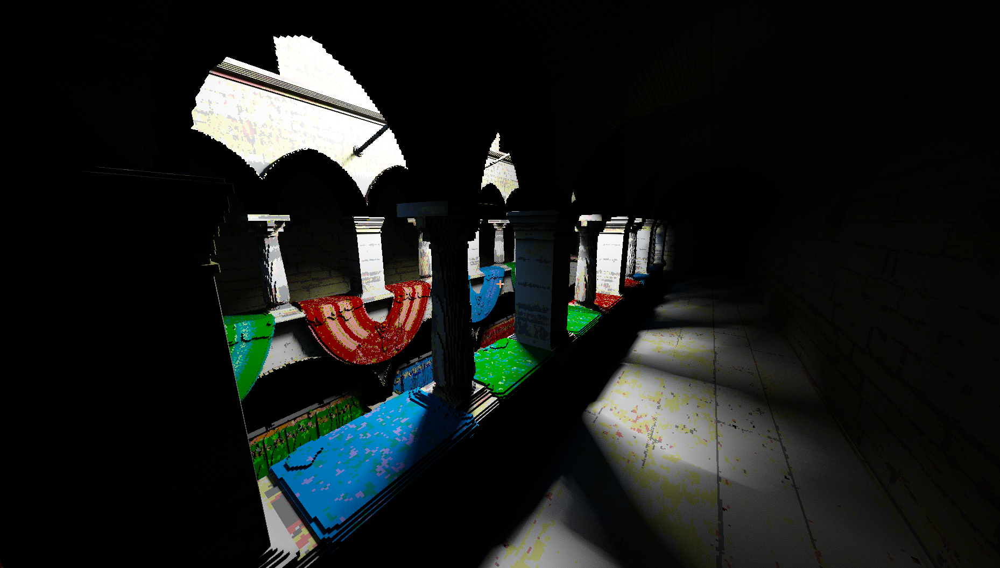

Experimental Voxel Raymarcher
============================

This repository contains the source for my experiments with a raymarching voxel renderer, global illumination, and Vulkan.

## Screenshots

These screenshots show the types of images the renderer can currently produce under the best circumstances. I'm still in the process of implementing improved sampling and denoising algorithms, so it doesn't look great while moving around yet.

## Performance

On a RTX 2070 Super, the raycasting shaders can cast ~200M Mrays/s, depending on geometry, which corresponds to around 20 fps when computing lighting for every pixel.
I plan on making a optimization pass later to improve this. 

## Rendering Pipeline

The main path-tracing pipeline is implemented as compute shaders (detailed below), while the UI is just rendered by a simple graphics pipeline.

* Primary Ray Intersection ([`intersect.comp`](src/shaders/intersect.comp))
* Sample Reprojection ([`reproject.comp`](src/shaders/reproject.comp))
* A-SVGF step 1: stratified sample replacement (TODO)
* Lighting 
  * Sample a bounce after the primary ray ([`light_bounce.comp`](src/shaders/light_bounce.comp))
  * Choose a random light source and generate rays from the first and second bounces ([`light_bounce.comp`](src/shaders/light_bounce.comp))
  * Check light occlusion for each of the light rays ([`light_occlude.comp`](src/shaders/light_occlude.comp))
  * Combine lighting information into a single image ([`light_combine.comp`](src/shaders/light_combine.comp))
* A-SVGF step 2: generate alpha buffer (TODO)
* TAA: use reprojected information and alpha buffer to mix current frame and reprojected samples (partially implemented)
* Postprocessing: compute an autoexposure effect and map HDR light values to LDR.
* Render 

## TODO

 * Every other frame (or so), only compute lighting for pixels with sample counts under a certain threshold.

 * Fully Implement A-SVGF

 * metropolis light transport for faster convergence

 * maybe implement some form of DLSS

## References

Here is list of papers and other resources I used while creating this system, sorted roughly by topic.

Voxels:

* [Efficient Sparse Voxel Octrees](https://users.aalto.fi/~laines9/publications/laine2010i3d_paper.pdf)
* [High Resolution Sparse Voxel DAGs](https://icg.gwu.edu/sites/g/files/zaxdzs1481/f/downloads/highResolutionSparseVoxelDAGs.pdf)
* [Interactively Modifying Compressed Sparse Voxel Representations](https://graphics.tudelft.nl/Publications-new/2020/CBE20/ModifyingCompressedVoxels-main.pdf)

Lighting:

* [Efficient BRDF Importance Sampling Using A Factored Representation](https://gfx.cs.princeton.edu/gfx/proj/brdf/brdf.pdf)
* [A Data-Driven Reflectance Model](https://cseweb.ucsd.edu/~ravir/6160/papers/p759-matusik.pdf)
* [Metropolis Light Transport](https://graphics.stanford.edu/papers/metro/metro.pdf)
* [A Practical Introduction to Metropolis LightTransport](https://pdfs.semanticscholar.org/a386/55316ee7f438ba115b38e8d0b1410c691a26.pdf)

Denoising:

* [Spatiotemporal Variance-Guided Filtering: Real-TimeReconstruction for Path-Traced Global Illumination](https://cg.ivd.kit.edu/publications/2017/svgf/svgf_preprint.pdf) (SVGF)
* [Gradient Estimation for Real-Time Adaptive Temporal Filtering](https://cg.ivd.kit.edu/publications/2018/adaptive_temporal_filtering/adaptive_temporal_filtering.pdf) (A-SVGF)